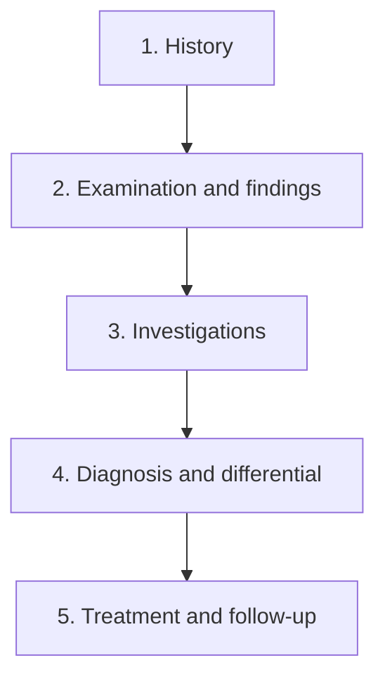

# TIP-AI Case Page UI/UX Analysis Report

**Screen reviewed:** Neurosurgery case-solving page  
**Review date:** August 13, 2026  
**Input:** User-provided 1920 × 1080 desktop screenshot  
**Review type:** Screenshot-based heuristic evaluation, clinical task-flow analysis, and preliminary accessibility review

> This report evaluates only the visible interface. Actual interactions, keyboard behavior, screen-reader output, exact source color values, error states, and mobile behavior were not tested in a running application. Therefore, observed issues and items that require implementation-level verification are deliberately distinguished.

---

## 1. Executive summary

The page has a recognizable foundation: the patient summary is on the left, the case workspace is in the center, the investigation catalog is on the right, and the case stages appear at the top. The dark theme is consistent, patient information is easy to locate, and progress counters are visible.

Its most important usability problem, however, is that **several clinical stages appear to be active at the same time**. In the screenshot:

- the system message asks the user to take a **history**,
- the top navigation marks **Treatment** as active,
- the right panel displays an **Order Test** catalog,
- the main input at the bottom asks for a **treatment plan**,
- the smallest navigation label points back to **History**.

The interface therefore cannot give one clear answer to the question, “What am I supposed to do now?” In a clinical education product, this is more than a visual inconsistency. It can lead to actions in the wrong stage, empty or incomplete submissions, unnecessary investigations, and misunderstanding of the assessment result.

### Recommended one-sentence strategy

**Make one clinical task primary at any given moment, and turn all other information into contextual support for that task.**

### Priority summary

| Priority | Objective | Expected outcome |
|---|---|---|
| P0 | Align the stage, main content, right panel, and primary action | Reduce task ambiguity and incorrect submissions |
| P0 | Make the scoring action safe and explainable | Prevent empty or premature assessment |
| P0 | Connect investigation selection to a visible selected-items flow | Reduce accidental, duplicate, and unjustified orders |
| P1 | Reorganize the information architecture and use of screen space | Reduce visual travel and cognitive load |
| P1 | Verify contrast, target size, keyboard, and screen-reader support | Move toward WCAG 2.2 AA conformance |
| P2 | Structure clinical reasoning and treatment inputs | Produce fairer scoring and more educational feedback |

---

## 2. Current information architecture

The screen is divided into five main regions:

1. **Top header:** Back link to clinics, specialty name, and the `Yeni Hasta` (New Patient) button.
2. **Case context:** Patient name, age, specialty, and History–Test–Diagnosis–Treatment stages.
3. **Left panel:** Patient card, chief complaint, known information, and progress counters.
4. **Central workspace:** Initial system message and a largely empty case-interaction area.
5. **Right and bottom action areas:** Investigation catalog, ordered-test results, question filters, treatment text field, and the `Puanla` (Score) button.

This is a reasonable starting structure for a desktop interface, but task ownership across the regions is unclear. The top stage navigation, contextual side panel, and bottom input appear to operate independently rather than representing one shared workflow state.

---

## 3. What already works well

- Patient identity, age, sex, and chief complaint are easy to locate in the upper-left area.
- The “Known Information” section makes it easy to rescan the available case facts.
- Visible counts for questions asked and tests ordered improve progress awareness.
- A search field is an appropriate component for a long investigation catalog.
- Grouping tests under category headings is a useful foundation for scanability.
- The accent color on the primary action helps establish visual hierarchy.
- The dark theme is generally consistent, and panel borders separate major regions.
- A dedicated empty state for ordered test results tells users where results will appear.

These strengths should be retained. The recommended redesign should clarify the workflow without discarding the existing three-region foundation.

---

## 4. Critical UI/UX gaps

### Severity definitions

- **P0 — Critical:** Directly affects the main task, data safety, or assessment validity.
- **P1 — High:** Materially affects completion time, error rate, or accessibility.
- **P2 — Medium:** Improves learnability, efficiency, or product quality.
- **P3 — Low:** A refinement for consistency or visual polish.

### Findings

| ID | Priority | Observation | User impact | Recommended solution |
|---|---:|---|---|---|
| UX-01 | P0 | The system expects history questions while Treatment is active; the right side shows a test catalog and the bottom field asks for treatment | The current task is unclear, and users may act in the wrong stage | Make the active stage the single source of truth; derive the heading, workspace, context panel, and primary action from it |
| UX-02 | P0 | The `Puanla` button appears active even when no response has been entered | An empty or premature assessment may be submitted | Disable it until mandatory input is valid and explain missing requirements next to the button |
| UX-03 | P0 | `Puanla` does not explain what will be scored or whether the action can be undone | Creates anxiety and false expectations around a high-impact action | Use a contextual label such as “Evaluate treatment”; show a summary or first-use explanation before submission |
| UX-04 | P0 | The result of selecting a test is not visible beyond a small `+` icon | Users may miss, duplicate, or order a test without understanding its state | Make the whole row selectable; add a “Selected investigations (n)” area, undo, and a separate submit step |
| UX-05 | P0 | `Yeni Hasta` is immediately available while a case is in progress | Unsaved work may be lost | Autosave drafts; show confirmation when the case has unsaved changes and provide “Return to case” |
| UX-06 | P1 | The central region is very wide but contains only a narrow message and a bottom bar | Screen space is wasted; key elements require long eye and pointer movement | Expand the active task into the center as a card or flow; constrain content to approximately 760–960 px |
| UX-07 | P1 | Stage tabs are very small, placed at the far right, and visually detached from the patient context | Progress is difficult to track and the active state is weak | Replace them with a numbered stepper showing complete, active, and incomplete states through text and icons |
| UX-08 | P1 | The relationship between `Sorular`, `Şikâyet & Semptom`, and `Tümü` controls is unclear | Users cannot tell whether they represent a filter, question type, or progress control | Create one labeled question toolbar with explicit labels and selected states |
| UX-09 | P1 | The right panel presents 72 tests in a long list without visible filters or favorites | Search effort and the risk of unnecessary ordering increase | Add favorites, system/panel filters, recent items, and keyboard-first search |
| UX-10 | P1 | The meanings of the `branş` and `çekirdek` badges are not explained | Users may misread them as priority or recommendation levels | Use explicit labels such as “Specialty-specific” and “Core test,” plus a legend or first-use explanation |
| UX-11 | P1 | Small gray text and thin borders appear low-contrast against the dark background | Readability and prolonged use are impaired, especially for low-vision users | Measure design tokens; target at least 4.5:1 for normal text and 3:1 for large text |
| UX-12 | P1 | The `+` icons, small tabs, and bottom navigation appear to have small interaction targets | Increases touch, motor-accessibility, and speed-related errors | Verify WCAG minimums; use a practical 40–44 px target for primary controls |
| UX-13 | P1 | A full `TC` national identity value is displayed | Creates an unnecessary personal-data signal in a training scenario | Use “Case ID” for synthetic data; otherwise mask the identifier |
| UX-14 | P1 | `KB: 150/90` uses an abbreviation and no unit | Meaning is less clear to novice students and the clinical data format is incomplete | Display “Blood pressure: 150/90 mmHg”; use name + value + unit for clinical values |
| UX-15 | P1 | Treatment entry appears to be a single-line free-text field | Medication, dose, route, frequency, and monitoring may be omitted; scoring becomes ambiguous | Use structured treatment rows plus a free-text clinical note |
| UX-16 | P1 | Test ordering and result viewing are stacked in the same narrow panel | Selection and comparison of results become difficult | Use Catalog / Selected / Results subviews or a contextual drawer |
| UX-17 | P1 | The empty state says to order a test “from above,” but does not distinguish adding from submitting | Users may assume that pressing `+` immediately orders the test | Clearly separate “Add investigation” from “Submit orders” |
| UX-18 | P1 | No clear autosave or draft state is visible | Users may fear losing work after refresh or connectivity loss | Show Saving / Saved / Offline draft states |
| UX-19 | P1 | The sticky bottom area has a weak relationship with the active content and stage | The action may be findable but its context is easily missed | Create a stage-specific composer containing label, help, validation, and actions in one region |
| UX-20 | P2 | Patient information is repeated in both the top row and left card | Consumes vertical space and adds noise | Keep a compact identity and status in the header; retain details in the left summary |
| UX-21 | P2 | Test rows do not show purpose, timing, cost, or educational context | Educational value decreases and test selection may become rote behavior | In practice mode, offer optional “Why this test?” and cost/time information |
| UX-22 | P2 | Decisions from earlier stages are not summarized in the current stage | The clinical reasoning chain becomes fragmented | Keep a persistent “My case notes” summary across stages |
| UX-23 | P2 | There is no preview of how feedback or scoring will be presented | Users cannot form an accurate mental model of the assessment | Define score components before submission; show evidence and improvement guidance afterward |
| UX-24 | P2 | The `Anamnez ▶` direction indicator is tiny and semantically ambiguous | Previous/next direction can be misunderstood | Use a complete label such as “← Previous: History” or “Next: Diagnosis →” |

---

## 5. The most critical issue: contradictory stages

### Current state

Five locations on the screen provide different task signals:

| UI element | Signal it gives |
|---|---|
| System message | Ask a history question |
| Top stage navigation | You are in Treatment |
| Right panel | Order a test |
| Bottom input | Enter a treatment plan |
| Bottom navigation | Go to History |

This weakens system-status visibility and the interface’s match with the user’s clinical goal. The solution is not merely to strengthen the active-tab color. **The entire page must derive from one shared active-stage state.**

### Recommended stage model

If Examination is not a separate product stage, it may be implemented as a structured findings section at the end of History. However, students must be able to understand when physical findings—such as neurological weakness—were obtained.

### What should change in each stage

| Stage | Central workspace | Right context panel | Primary bottom action |
|---|---|---|---|
| History | Conversation history and question input | Known facts and received answers | Ask question |
| Examination | Examination selection and findings | System-specific examination tools | Perform examination |
| Investigations | Selected tests and rationales | Searchable investigation catalog | Submit orders |
| Diagnosis | Problem representation, differential, and confidence | Summary map of findings | Save diagnosis |
| Treatment | Structured plan and monitoring | Diagnosis, allergy, contraindication, and result summary | Evaluate treatment |

Users should be able to return to a completed stage. When a change affects later work, the product should explain the impact. For example, ordering a new test should not silently invalidate diagnosis and treatment drafts, but it should trigger a “New results available” review notice.

---

## 6. Recommended desktop layout

### Top bar

- Left: `Clinics / Neurosurgery / Case #NS-1042`
- Center: numbered stage indicator
- Right: `Saved`, practice/exam mode, timing information, and `Change case`

### Left panel — case summary

- Patient or scenario name, age, and sex
- Chief complaint
- Known facts and newly discovered facts in separate groups
- Vital signs and alerts
- Collapsible “My case notes” section
- Fixed panel on desktop; drawer on smaller screens

### Center — active task

- One prominent stage heading
- A task surface dedicated to that stage
- Interaction or decision timeline when needed
- Content width of approximately 760–960 px, centered on very wide screens
- Start guidance or a clear task explanation instead of a large empty area

### Right panel — contextual tool

- Only tools that support the active stage
- Investigation catalog during Investigations; allergies, contraindications, and result summary during Treatment
- Visible panel title, selected-item count, and clear collapse/close control

### Bottom composer — stage-specific input

- Visible field label
- Helpful example and validation message
- Autosave state
- Secondary action: save draft or go back
- Primary action: an explicit verb tied to the current stage

---

## 7. Redesigning the investigation-ordering experience

Displaying 72 tests in one right-hand list can function as a catalog, but it is incomplete as a clinical decision workflow.

### Recommended interaction

1. The user searches or selects a category.
2. The entire row is selectable; the small `+` icon is not the only target.
3. The test is added to “Selected investigations,” and its row changes to Added.
4. In practice mode, the user may enter a short rationale.
5. The system warns about duplicates or a test already included in a selected panel.
6. The user reviews the set and submits all orders with one explicit action.
7. The state changes from `Pending → Result available`, with a live announcement for screen-reader users.

### Recommended test-row content

- Full test name
- Explicit tag: `Core` / `Specialty-specific`
- Panel relationship, if applicable
- Selection state: `Add`, `Added`, `Result available`
- One keyboard-accessible row target
- Accessible-name example: “Select Free T3 test”

### Search and classification

- Typo tolerance and synonym support
- System filters such as hematology, biochemistry, endocrinology, and imaging
- Favorites and Recently used
- Optional “What does this test assess?” explanation in practice mode
- Result count and guidance for zero-result searches
- Categories in a consistent alphabetical or clinical-system order

The screenshot shows a Pancreas heading followed by Thyroid and then ABG-related groups. This suggests that the category hierarchy may become detached during scrolling or may not be visually strong enough. The actual DOM and scroll behavior should be verified.

---

## 8. Treatment entry and assessment experience

A single free-text field may be sufficient for an early prototype, but it is difficult to reliably extract medication, dose, route, frequency, duration, and monitoring.

### Recommended structure

#### Medication row

- Medication or active ingredient
- Dose and unit
- Route
- Frequency
- Duration
- Rationale

#### Additional sections

- Intervention or procedure
- Supportive treatment
- Consultation or referral
- Monitoring and follow-up parameters
- Patient education
- Free clinical note

The structure should not force a predetermined answer. Users should be able to add multiple rows through “Add another treatment,” while retaining a free-note field.

### Assessment button

Replace `Puanla` with the contextual label **Evaluate treatment**.

The button should be disabled when:

- no treatment or intervention has been entered,
- a structured row is missing mandatory information,
- saving is still in progress,
- an unresolved critical validation from an earlier stage exists.

The interface should state whether the response can be edited after assessment. The result should present more than a total score: strong decisions, critical omissions, unnecessary or risky actions, and differences from an ideal approach should all be explained.

---

## 9. Visual design and readability

### Hierarchy

- The stage heading and primary task should be visibly stronger than category headings.
- The large empty region does not make important elements more prominent; it fragments the context.
- Active-stage state should not depend only on a dark/light background difference. Add an underline, icon, or visible Active state.
- Increase the typographic distinction between category headings and test rows in the right panel.

### Typography

- Use approximately 14–16 px as a desktop starting point for body text.
- Avoid going below 12 px for patient identity or helper text.
- Use line spacing around 1.4–1.5 for longer passages.
- Small all-caps labels become harder to read when combined with low contrast; normal title case is preferable.

### Color and contrast

Some secondary text, dividers, tags, and placeholders appear low-contrast against the dark background. A definitive judgment requires measurement using the source design tokens.

Under [WCAG 2.2 Success Criterion 1.4.3](https://www.w3.org/WAI/WCAG22/Understanding/contrast-minimum.html), target at least **4.5:1** for normal text and **3:1** for large text. Component boundaries and states should not rely solely on very thin, low-contrast lines.

---

## 10. Accessibility review

W3C recommends using the current [WCAG 2.2](https://www.w3.org/TR/WCAG22/) standard for new or updated accessibility work. The target for this page should be at least **WCAG 2.2 AA**.

### Items to verify

| Area | Verification |
|---|---|
| Keyboard | Stages, test search, test rows, selected items, and assessment must work without a pointer |
| Focus | Every control needs a visible high-contrast focus style; the sticky bottom region must not obscure focus |
| Focus order | Header → stage → patient summary → main task → contextual tool → primary action should form a logical sequence |
| Target size | Measure the small `+` buttons and stage tabs against [WCAG 2.2 SC 2.5.8](https://www.w3.org/WAI/WCAG22/Understanding/target-size-minimum.html); use 40–44 px for primary controls as a practical product target |
| Labels | The icon-only `+` control must have an accessible name containing the test name |
| Tab semantics | Use `tablist`, `tab`, `tabpanel`, `aria-selected`, and correct arrow-key behavior |
| Status messages | Added test, saved state, error, and result-ready messages should be exposed through an appropriate `aria-live` region |
| Use of color | Active, complete, and error states must not be communicated through color alone |
| Form errors | Error text must be programmatically associated with its field and include correction guidance |
| Reflow | Critical functions must remain available at 200% zoom and 320 CSS px width |
| Screen reader | Patient card, known facts, counters, and results need meaningful headings and landmarks |

Visible keyboard focus is not merely a styling preference; it is a requirement under [WCAG 2.2 SC 2.4.7](https://www.w3.org/WAI/WCAG22/Understanding/focus-visible.html).

---

## 11. Microcopy recommendations

Because the reviewed product interface is in Turkish, both corrected Turkish copy and an English localization are provided.

| Current UI copy | Issue | Recommended Turkish | Recommended English |
|---|---|---|---|
| Yeni Hasta | Does not communicate the risk of leaving an active case | Vakayı değiştir | Change case |
| Test İste | Unclear whether it names a catalog or a submission action | Tetkik seç | Select investigations |
| branş | Too short and open to interpretation | Branşa özel | Specialty-specific |
| çekirdek | Meaning is not explained | Temel test | Core test |
| Puanla | The object and consequence are unclear | Tedaviyi değerlendir | Evaluate treatment |
| Sorular | Purpose of the control group is unclear | Soru alanı / Anamnez soruları | Question area / History questions |
| Tümü ▶ | It is unclear what “all” refers to or what the arrow means | Tüm soruları göster | Show all questions |
| Anamnez ▶ | Direction and action are ambiguous | ← Önceki adım: Anamnez | ← Previous: History |
| Henüz test istenmedi. Yukarıdan test iste. | Does not distinguish adding from submitting | Seçtiğin tetkikler burada görünecek. Başlamak için katalogdan bir tetkik seç. | Selected investigations will appear here. Choose one from the catalog to begin. |
| KB: 150/90 | Abbreviation and unit are missing | Kan basıncı: 150/90 mmHg | Blood pressure: 150/90 mmHg |

Terminology should also be consistent across the product. In Turkish, choose `test`, `tetkik`, or `laboratuvar testi` according to a documented content standard rather than mixing them unpredictably.

---

## 12. Responsive behavior

| Viewport | Recommended structure |
|---|---|
| ≥ 1440 px | Left case summary + main task + right contextual panel; center constrained to a maximum width |
| 1024–1439 px | Collapsible left panel; right panel as a drawer or tabbed panel |
| 768–1023 px | Main task at full width; case summary and tools in separate drawers |
| < 768 px | Single column; compact stage header instead of horizontally scrolling stepper; sticky bottom action; test catalog as a full-screen sheet |

Do not use a proportionally shrunken three-column layout on mobile. Patient summary and investigation catalog may move into drawers, but the selected-test count and active stage should remain visible.

---

## 13. Additional recommendations for clinical education

### Problem representation

Instead of a single diagnosis input, the Diagnosis stage can include:

- a concise problem representation,
- leading diagnosis,
- at least two differential diagnoses,
- findings that support or oppose each diagnosis,
- confidence percentage.

This allows the system to assess clinical reasoning, not only the final answer.

### Investigation rationale

When a test is selected in practice mode, the product may request an optional or mandatory short rationale. In exam mode, this field may be hidden or required depending on the assessment design.

### Feedback order

1. Critical safety issue or missed red flag
2. Strong decisions
3. Unnecessary investigation or treatment
4. Evidence map
5. Difference from the ideal approach
6. One clear action to apply in the next case

### Practice and exam modes

The interface should behave differently in the two modes:

- **Practice:** explanations, hints, rationales, undo, and progressive feedback.
- **Exam:** limited assistance, explicit timing and attempt policy, and clear post-submission locking behavior.

The current mode should remain visible in the top bar.

---

## 14. Prioritized implementation plan

### Quick fixes — 1–3 days

- Align the active stage with the system message, right panel, input placeholder, and primary button.
- Disable assessment when the treatment response is empty.
- Replace `Puanla` with a stage-specific action.
- Add an unsaved-change warning to `Yeni Hasta`.
- Clarify `branş/çekirdek`, `KB`, and ambiguous navigation copy.
- Enlarge small interaction targets and add a visible focus style.
- Replace `TC` with Case ID or mask it.

### First iteration — 1–2 weeks

- Convert the top tabs into a state-aware stepper.
- Build a contextual right panel that changes with the active stage.
- Add a Selected investigations area and batch submission.
- Use task cards or a conversation flow in the central workspace.
- Add autosave and a visible save-state indicator.
- Audit contrast and typography through design tokens.
- Implement breakpoints for 1366 × 768, 1024 px, tablet, and mobile.

### Second iteration — 3–6 weeks

- Add structured diagnosis and treatment inputs.
- Connect investigation rationales and educational explanations to practice mode.
- Add screen-reader and keyboard-only tests to the CI acceptance gate.
- Implement event tracking and UX metrics.
- Run task-based usability sessions with five students, followed by a faculty or clinical reviewer session.

### Later stage

- Adaptive case recommendations based on student performance.
- Clinical decision calibration and unnecessary-test tendency analytics.
- Case versioning, rubric management, and feedback tools for faculty.

---

## 15. Measurement plan

The redesign should not be judged by visual approval alone.

| Metric | Definition | Initial target |
|---|---|---|
| Time to first correct action | Time from opening a case to the first action appropriate to the active stage | At least 25% lower than baseline |
| Out-of-stage action rate | User initiates an action unrelated to the active stage | <5% |
| Empty/incomplete submission | Validation failures during assessment attempts | <2% |
| Investigation search success | Search session that results in a test selection | >90% |
| Duplicate-test rate | Same test accidentally added twice | <1% |
| Case completion rate | Completed cases divided by started cases | Increase from baseline |
| Task completion time | Median and p90 time by stage and case | Decrease while preserving learning objectives |
| Backtracking rate | Return to an earlier stage caused by misunderstanding | Qualitative analysis during usability testing |
| Accessibility | Automated and manual critical WCAG findings | 0 critical; documented AA coverage |
| UMUX-Lite/SUS | Perceived usability after task completion | Compare before and after redesign |

Clinical education metrics should support individual development and anonymized cohort trends, not public student ranking.

---

## 16. Acceptance criteria

The redesigned case page should be considered complete when:

- [ ] The active stage, page heading, central workspace, right panel, and primary action do not contradict one another.
- [ ] Users can explain the current task without assistance after opening the page.
- [ ] Empty or invalid responses cannot be assessed, and missing information is clearly identified.
- [ ] Test selection, undo, batch submission, and result states are distinct.
- [ ] The same test cannot be added twice by accident.
- [ ] Changing the case cannot silently discard unsaved progress.
- [ ] Every critical flow can be completed with the keyboard alone, with visible focus throughout.
- [ ] Icon-only controls have accessible names.
- [ ] Normal and large text meet the WCAG 2.2 contrast targets.
- [ ] Critical functions remain available at 200% zoom and 320 CSS px width.
- [ ] At 1366 × 768, both the active stage and primary action are accessible without layout failure.
- [ ] Autosave status is visible and drafts survive connectivity loss.
- [ ] The result explains the components of the score and actionable improvement areas.
- [ ] National identity numbers are not shown when real patient identity is unnecessary.
- [ ] Task testing with at least five target users produces no unresolved critical usability failure.

---

## 17. Conclusion

The basic three-column layout can be retained. The primary need is not cosmetic refinement but **task orchestration**. The highest-value change is to make one current task unambiguous and derive the entire screen from the active clinical stage.

Before adding new features, the first release should address:

1. contradictory stage signals,
2. safe and explainable assessment,
3. an investigation-ordering flow with a visible selected-items state.

After these foundations are in place, the team should improve use of space, structured clinical reasoning, accessibility, and responsive behavior. In this order, the page will become both easier to use and more educational, allowing students to focus on clinical reasoning rather than the interface.

